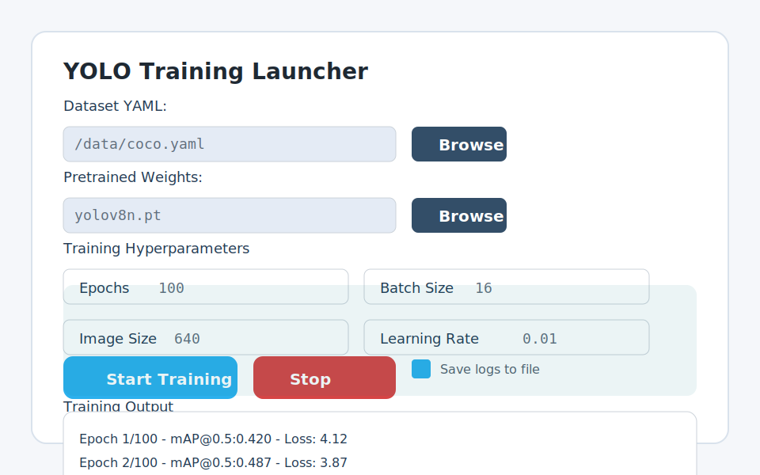

# YOLO Training GUI

This repository provides a simple Tkinter-based desktop application for
configuring and launching YOLO training runs. Use it to pick a dataset YAML,
select pre-trained weights, and start training with a friendly interface.

## Requirements

- Python 3.9+
- Tkinter (included in most Python distributions)
- [`ultralytics`](https://pypi.org/project/ultralytics/) package providing the
  `yolo` command line interface
- (Optional) [PyTorch](https://pytorch.org/get-started/locally/) with CUDA
  support if you plan to leverage GPU acceleration
- (Optional) [`Pillow`](https://pypi.org/project/Pillow/) for high-quality
  previews of test images inside the GUI

## Quick command checklist

Follow the commands below if you just want the fastest path from cloning the
repository to launching the GUI:

```bash
# 1. (Optional) Create and activate a virtual environment
./scripts/create_virtualenv.sh
source .venv/bin/activate

# 2. Install Python dependencies inside that environment
./scripts/install_dependencies.sh

# 3. Launch the YOLO training GUI
./scripts/run_gui.sh

# 4. (Optional) Run the automated tests
python -m unittest discover -s tests
```

Each command can be executed independently if you only need a specific step.

Optionally create and activate an isolated virtual environment:

```bash
./scripts/create_virtualenv.sh
source .venv/bin/activate
```

> Pass a custom directory name as the first argument if you do not want to use
> the default `.venv` folder. Set the `PYTHON_BIN` environment variable before
> running the script to choose a specific Python executable.

Install dependencies with the provided helper script:

```bash
./scripts/install_dependencies.sh
```

> The script upgrades `pip` and installs packages listed in
> [`requirements.txt`](requirements.txt). You can still run `pip install -r
> requirements.txt` manually if you prefer.

## Usage

Run the GUI application:

```bash
./scripts/run_gui.sh
```

> Pass any additional command-line options to `run_gui.sh` and they will be
> forwarded to `python yolo_gui.py`.

1. Click **Select** next to "Dataset YAML" to choose your dataset configuration
   file.
2. Click **Select** next to "Model Weights" to pick the pre-trained `.pt`
   weights file.
3. Adjust epochs, batch size, image size, project name, and task as needed.
4. Press **Start Training** to launch the YOLO CLI in the background. Training
   logs stream into the window. Use **Stop** to terminate the run early.
5. Use the **Model Testing** panel to pick an image folder for quick
   predictions. Navigate between files with **← Previous** and **Next →**,
   then click **Solve** to run inference on the highlighted image. A dedicated
   preview window keeps the active picture visible while you browse and test.
6. Review the CUDA status banner above the log area to confirm whether your
   environment exposes GPU acceleration for PyTorch.

> **Note:** Ensure that the `yolo` executable from the `ultralytics` package is
> available on your PATH before starting training.

## GUI Preview

The mock-up below illustrates the layout you will see when launching the
application, including dataset and weights pickers, hyperparameter fields, and
training log output.



## Mock configurations for dry runs

If you want to experiment without launching real training jobs, call
`generate_mock_training_configs()` from `yolo_gui.py`. By default it returns 30
distinct `TrainingConfig` objects that simulate different tasks and
hyperparameters, making it easy to script dry runs or populate demos.

## Model testing workflow

After choosing a weights file you can test the model without leaving the GUI:

1. Click **Select** inside the **Model Testing** panel and point to a folder
   containing sample images.
2. Cycle through the images with the navigation buttons to preview filenames
   and counts. A separate preview window automatically opens to display the
   highlighted image, resizing it to fit within the window.
3. Press **Solve** to invoke `yolo mode=predict` on the active image. The log
   view displays CLI output alongside a summary of how long the inference took
   and whether any objects were detected.
4. Keep an eye on the performance banner under the buttons to see how many
   images have been processed, together with the latest, average, and best
   inference times plus the detection count from the most recent run.

> Close the preview window at any time if you need more space; it will pop back
> up automatically the next time you navigate to an image or start a new test
> run.

The app automatically disables navigation buttons when only a single image is
available and resets the statistics each time you choose a new folder.

## Versioning

Project changes are tracked in [`CHANGELOG.md`](CHANGELOG.md). The GUI window
title also displays the current version so you can confirm which build is
running at a glance.

## Testing

Run the unit tests to verify the command-building logic for the training
configuration helper:

```bash
python -m unittest discover -s tests
```
